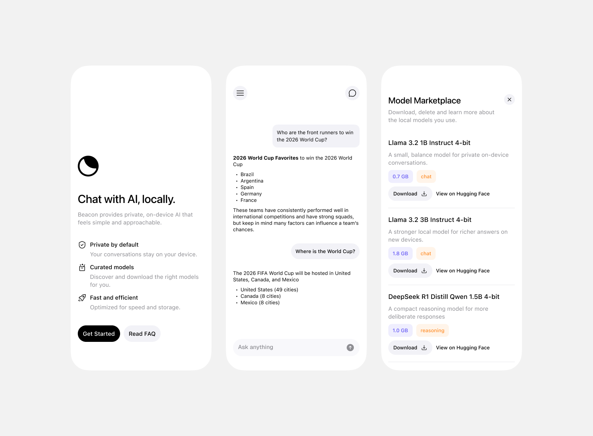

# Beacon

Beacon is a simple iOS app for chatting with local AI models on your device.

It lets you download curated models, manage local model storage, and keep private chat history without sending conversations to a server.

## Features

- Private on-device chat
- Local model downloads
- Model marketplace
- Persisted chat history
- Markdown assistant responses

## Requirements

- iOS Simulator or device supported by the project
- Xcode
